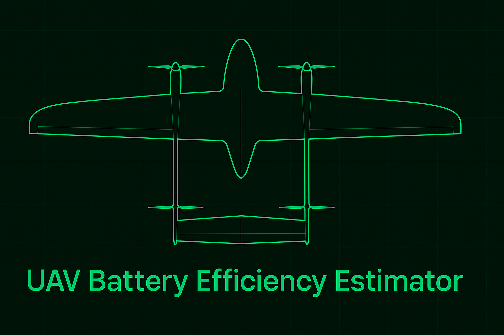

This is a lightweight AI-powered estimator for calculating UAV (drone) flight time and distance based on key mission parameters.

## Features

- **Flight Time Estimation**  
  Calculates the expected flight duration in minutes based on real-world parameters including battery capacity, payload weight, flight speed, wind resistance, and flight mode (hover vs. forward flight). Useful for planning missions within the drone's safe operating limits.

- **Distance Coverage Estimation**  
  When in forward flight or waypoint mode, the app estimates how far the drone can travel based on flight time and speed, helping you plan delivery routes, aerial mapping areas, or survey zones.

- **Dynamic Power Consumption Model**  
  Uses a basic physics-informed formula to approximate power draw affected by payload, wind speed, and flight mode. Designed to balance realism with computational simplicity.

- **Mission Risk Insight (AI Style)**  
  Simulates AI-generated advice using rule-based logic. Based on your input, the app suggests practical adjustments such as reducing payload, avoiding high winds, or increasing battery size to improve endurance or safety.

- **Clean, Interactive User Interface**  
  Built with [Streamlit](https://streamlit.io) for ease of use and optimized for both desktop and mobile screens—including iPhone. The interface is form-based, intuitive, and supports live updates without reloads.

- **Standalone and Demo-Ready**  
  Requires no connection to real UAV hardware. All calculations are performed locally using user input or simulated values, making it ideal for demonstrations, training, or rapid prototyping.

## How to Run

```bash
pip install streamlit
streamlit run app.py
```

## Author

Tareq Omrani  
GitHub: [@tareqomrani](https://github.com/tareqomrani)

---
*Part of an AI Engineering + UAV toolkit series.*
