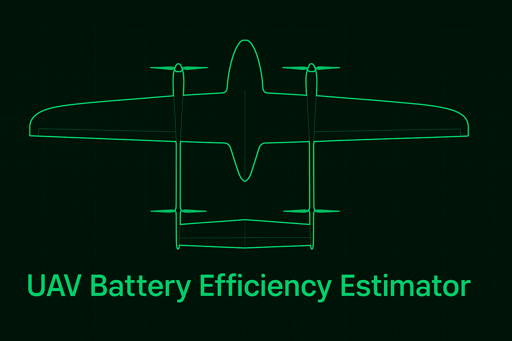

 🌟 Highlights

Aerospace-grade physics
ISA density, fixed-wing drag polar, rotor induced-power scaling, gust/terrain penalties, climb/descent energy, dispatch reserves, and thermal modeling.

🔋 Battery + ⛽ ICE
Battery derating, usable capacity, live battery/fuel gauges, BSFC fuel burn, climb fuel, usable fuel fraction, and MQ-1 / MQ-9 Hybrid Assist.

🕵️ Stealth & Detectability
AI-visual and IR-thermal scores (0–100), factoring cloud cover, altitude, speed, gusts, platform type, power system, thermal ΔT, and stealth-load penalties.

🤖 LLM Mission Advisor
GPT-4o-mini mission recommendations with graceful heuristic fallback when no API key is found.

🐝 Swarm Advisor
Multi-agent UAV roles, agent proposals, LEAD fusion, Stealth Ingress logic, threat-zone auto-assist, conversation rounds, and playback state updates.

🎞️ Mission Playback
Waypoint following, swarm mission map, threat-zone visualization, per-agent timeline, and CSV exports.

📊 Individual UAV Detailed Results
Full selected-platform summary with human-readable calculations and machine-readable JSON.

📱 Mobile-friendly UX
Auto-select numeric inputs on focus, clean controls, compact Streamlit layout, and clear battery/fuel gauges.

📤 One-click Exports
Scenario Summary, Detailed UAV Results, Swarm Playback, and Mission Waypoints in CSV/JSON formats.

No API key? No problem. The app automatically switches to heuristic mission logic.

⸻

🧭 Workflow Overview

1️⃣ Select a UAV → Choose from battery multirotors, battery fixed-wing UAVs, ICE MALE platforms, or Custom Build.

2️⃣ Set mission parameters → Payload, speed, altitude, wind, temperature, elevation gain, terrain, stealth factor, cloud cover, gusts, and flight mode.

3️⃣ Estimate → Air density, power/fuel use, endurance, total distance, best/upwind range, ΔT, and detectability risk.

4️⃣ Plan → Receive GPT-based mission recommendations or heuristic alternatives.

5️⃣ Swarm & Playback → Simulate multi-agent behavior, Stealth Ingress, threat-zone response, waypoint movement, and mission-map playback.

6️⃣ Export → Download Scenario Summary, Individual UAV Results, Swarm Playback, and Waypoints.

⸻

📦 Included UAV Profiles

Small multirotors / COTS: Generic Quad, DJI Phantom, Skydio 2+, Freefly Alta 8

Small tactical / fixed-wing: RQ-11 Raven, RQ-20 Puma, Teal Golden Eagle, Quantum Systems Vector

MALE ICE platforms: MQ-1 Predator, MQ-9 Reaper

Sandbox: Custom Build

⸻

🛠️ Inputs & Controls

Flight Parameters: Battery Wh, Payload (g), Speed (km/h), Wind (km/h), Temperature (°C), Altitude (m), Elevation Gain (m), Flight Mode, and Failure Simulation toggle.

Environment: Cloud cover (%), Gust Factor, Terrain Complexity (×), and Stealth Drag Factor (×).

ICE Panel: Fuel tank, wing area S, wingspan b, C_D0, Oswald e, propulsive η_p, BSFC, fuel density, Hybrid Assist fraction, and assist duration.

Swarm & Stealth: Swarm size, conversation rounds, Stealth Ingress toggle, Threat Zone Radius, and waypoint list.

Waypoints: (x,y) coordinates in km, such as 2,2; 5,0; 8,-3.

Debug: Enable Debug Mode and optional Battery Override clamp.

⸻

📊 Key Outputs

Atmospheric Data: Air density ρ and density ratio ρ/ρ₀.

Applied Environment Factors: Rotor density factor or fixed-wing lift/drag handling, plus gust, terrain, and stealth penalties.

Power & Fuel: Fixed-wing aero power, rotorcraft draw, total shaft+hotel power, fuel burn, climb fuel, usable fuel, and battery derating.

Endurance & Range: Dispatchable endurance, uncertainty band, total distance, best-heading range, and upwind range.

Thermal Model: ΔT computed from convective and radiative heat rejection with cloud-cover attenuation.

Detectability Scores: AI-visual / IR-thermal scores (0–100) with LOW / MODERATE / HIGH overall tag.

Detailed Results: Selected UAV calculations in copy-ready bullets and machine-readable JSON.

Swarm Advisor: Initial states, agent proposals, LEAD actions, updated states, playback map, and exportable logs.

Live Simulation: Animated battery/fuel gauge with elapsed and remaining time indicators.

⸻

🧠 LLM Mission Advisor

Uses OpenAI GPT-4o-mini when OPENAI_API_KEY is available.

Outputs 3–5 concise, scenario-specific mission recommendations.

Automatically falls back to heuristic guidance when no API key is found.

⸻

🐝 Swarm Advisor (Multi-Agent)

Each UAV acts as an autonomous agent with a role: LEAD, SCOUT, TRACKER, RELAY, or STRIKER.

Agents propose actions such as RTB, LOITER, HANDOFF_TRACK, RELOCATE, ALTITUDE_CHANGE, SPEED_CHANGE, RELAY_COMMS, STANDBY, or HYBRID_ASSIST.

The LEAD agent fuses decisions using environmental context, mission state, threat-zone logic, and endurance constraints.

Stealth Ingress Mode automatically enables Hybrid Assist for MQ-1 / MQ-9 platforms inside the threat zone.

Playback Timeline simulates agent movement, waypoint following, endurance burn-down, fuel burn-down, and thermal-state changes.

⸻

📤 Export Options

Scenario Summary: mission_results.csv / mission_results.json

Detailed UAV Results: *_detailed_results.csv / *_detailed_results.json

Swarm Playback: swarm_mission_playback.csv

Mission Waypoints: mission_waypoints.csv

⸻

🧪 Physics & Realism

ISA Atmosphere: Troposphere density model applied to aerodynamic and rotor calculations.

Fixed-wing: Drag polar using C_D0, Oswald e, aspect ratio, wing area, wingspan, and propulsive efficiency.

Rotorcraft: Mass scaling, density scaling, parasitic speed term, and gust penalty.

Reserves: 30% dispatch reserve, 85% usable battery, and 90% usable fuel.

Thermals: ΔT from waste heat divided by convective + radiative heat sink.

Climb/Descent: mgh energy for climb and 20% descent recovery for battery platforms.

Temperature Effects: Battery derating below 15°C and above 35°C.

ICE Modeling: BSFC fuel burn, fuel density, climb fuel, usable fuel fraction, total shaft+hotel power, and optional Hybrid Assist.

This is an educational, planning-grade estimator. Validate results before operational use.

⸻

🧩 FAQ

Do I need an API key?
No. LLM features automatically revert to heuristic logic when unavailable.

Can I add new UAVs?
Yes. Extend the UAV_PROFILES dictionary with new platform data.

Why is endurance lower than manufacturer specs?
The estimator includes dispatch reserves, usable energy limits, hotel loads, gust/terrain drag, stealth penalties, and temperature derates.

Does the app support ICE platforms?
Yes. MQ-1 Predator and MQ-9 Reaper use the ICE branch with fuel burn, climb fuel, usable fuel, and optional Hybrid Assist.

⸻

🗺️ Roadmap

Optional 3D flight-path animation and terrain tiles.

Expanded hybrid fuel mapping and pack-health analytics.

Import/export full mission plans using a JSON schema.

Improved route optimization and waypoint planning.

